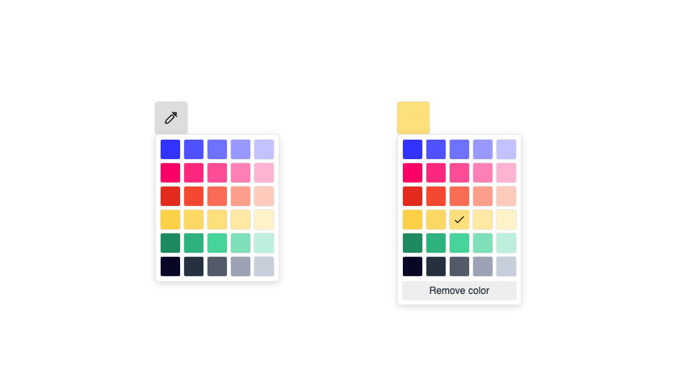

# Vueticol
Beautiful color picker for Vue 🌈



## Installation

You can install the package via npm:

``` Install
npm i vueticol
```

## Import
```
import Vueticol from 'vueticol';
import 'vueticol/dist/vueticol.css';
```

```
app.use(Vueticol);
```

## Usage

```
<vueticol v-model="color" />
```

### Options

| Name       | Type          | Default        | Description                      |
|------------|---------------|----------------|----------------------------------|
| colors     | array<string> | See screenshot | Array of colors                  |
| style      | string        | "square"       | If you want a square or a circle |
| removeText | string        | "Remove color" | Text for remove button           |
